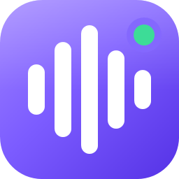

<p align="center"></p>

# Soundboard

A local Windows soundboard. Press a hotkey and a sound plays **through your microphone** in Discord, games, OBS or any app that records a mic. You hear it in your own headphones at the same time. Your voice still goes through as normal; the sounds are mixed on top.

Everything runs on your PC. There's no account, no cloud and no telemetry.

---

## Contents

- [How it works](#how-it-works)
- [Installation](#installation)
- [First-time setup](#first-time-setup)
- [Using the app](#using-the-app)
- [Features](#features)
- [Troubleshooting](#troubleshooting)
- [For developers](#for-developers)

---

## How it works

Windows doesn't let one program write audio into another program's microphone. The Soundboard gets around this with a free **virtual audio cable**. The cable is a pretend playback device (**CABLE Input**) connected to a pretend microphone (**CABLE Output**).

```
Your real mic ─────► Mic → cable ─────┐
                                      ├─► mixer ─► limiter ─► CABLE Input ══► CABLE Output = the "mic" Discord/games use
Soundboard sounds ─► Sounds → cable ──┘
Soundboard sounds ─► Monitor ─────────────────► limiter ─► your headphones (so you hear the sounds too)
```

- Your **voice** and the **sounds** are mixed together and sent into the cable.
- In Discord or your game, you select **CABLE Output** as your microphone.
- Only the **sounds** go to your headphones, so you don't hear your own voice echoed back.

---

## Installation

### 1. Install VB-Audio Virtual Cable (required)

The virtual cable is a free driver from VB-Audio. You only install it once.

1. Download it from **<https://vb-audio.com/Cable/>**. Choose the Windows download, **"VBCABLE_Driver_Pack"**.
2. Extract the ZIP.
3. Right-click **`VBCABLE_Setup_x64.exe`** → **Run as administrator** → **Install Driver**.
4. **Restart your PC.**
5. Check that it worked. Open Windows Sound settings (press `Win + R`, type `mmsys.cpl`, press Enter):
   - The **Playback** tab should list **CABLE Input (VB-Audio Virtual Cable)**.
   - The **Recording** tab should list **CABLE Output (VB-Audio Virtual Cable)**.

> **Don't** make either CABLE device your Windows default. The Soundboard selects them itself, and your normal speakers/mic should stay the defaults.

VB-Cable is donationware; if you find it useful, consider supporting VB-Audio on their site.

### 2. Get the Soundboard

**Option A: Use a pre-built `Soundboard.exe`**

If someone gave you a published `Soundboard.exe`, put it in any folder (for example `C:\Tools\Soundboard\`) and run it. That build includes everything it needs, so you don't install anything else.

**Option B: Build it yourself**

Requirements:

- Windows 10 or 11
- [.NET 10 SDK](https://dotnet.microsoft.com/download/dotnet/10.0)
- Optional: [Visual Studio 2026](https://visualstudio.microsoft.com/) with the **.NET desktop development** workload

Build a standalone `Soundboard.exe` (no .NET install needed on the PC that runs it):

```bash
dotnet publish src/Soundboard.App -c Release -r win-x64 --self-contained -p:PublishSingleFile=true -p:IncludeNativeLibrariesForSelfExtract=true -o publish
```

The app is written to `publish\Soundboard.exe` (about 165 MB, because the .NET runtime is bundled in).

For a much smaller build, leave out the bundled runtime. The PC that runs it then needs the [.NET 10 Desktop Runtime](https://dotnet.microsoft.com/download/dotnet/10.0):

```bash
dotnet publish src/Soundboard.App -c Release -o publish
```

---

## First-time setup

1. **Start the Soundboard.** On first launch it picks sensible defaults:
   - **Your microphone:** your Windows default recording device
   - **Send to (virtual cable):** CABLE Input, found automatically
   - **Monitor (your headphones):** your Windows default playback device
2. **Check "Your microphone."** Make sure it's the mic you actually talk into. If it's wrong, Discord will hear the sounds but not you.
3. The audio engine starts automatically. The title bar shows a green **● Live** when it's running.
4. **In Discord:** go to *User Settings → Voice & Video → Input Device* and pick **CABLE Output (VB-Audio Virtual Cable)**. Use **Mic Test** to hear yourself plus a test sound.
5. **In games, OBS and other apps:** pick **CABLE Output** as the microphone or audio input the same way.

> **Tip:** Set your mic and CABLE Input to **48000 Hz** in `mmsys.cpl` → device → *Properties → Advanced*. Other sample rates still work, but 48 kHz avoids extra conversion.

---

## Using the app

### Adding sounds

- Click **Add sounds** and pick one or more files, **or**
- **Drag and drop** audio files anywhere onto the window.

Supported formats: **WAV, MP3, OGG, FLAC, M4A, AAC, WMA, AIFF**.

Sounds are loaded into memory when added, so they start instantly when you press a hotkey.

### Assigning a hotkey

1. On a sound card, click the **⌨ Set hotkey** button. It changes to *Press keys…*.
2. Press **one key** (e.g. `F13`, `Num 1`) or **two keys together** (e.g. `Ctrl + 1`, `Num 1 + Num 2`).
3. Release the keys and the hotkey is saved.
   - Press **Esc** to cancel.
   - Click **✕** next to a hotkey to remove it.

Hotkeys are **global**: they work while you're in a game, in Discord, or anywhere else. Key order doesn't matter, and left/right `Ctrl`, `Shift` and `Alt` are treated as the same key. A hotkey can only belong to one sound. Assigning it to a new sound removes it from the old one.

### Playing and stopping

- Press the sound's hotkey, or click the round **▶** button on its card.
- While a sound plays, its card glows and its progress bar fills. Click the **■** button to stop it.
- **Stop all** stops everything that's playing. You can give it its own hotkey in the sidebar.

---

## Features

### Sound cards

| Part of the card | What it does |
|---|---|
| **Name** | Click the name to rename the sound. Hover the name to see the original file path. |
| **Length** | Duration of the sound. Shows an error in red if the file couldn't be loaded, for example if it was moved or deleted. |
| **▶ / ■** | Play or stop the sound, with a progress bar. |
| **⌨ Hotkey** | Click to record a 1- or 2-key hotkey; **✕** clears it. |
| **Mode** | Click to cycle through the three modes below. |
| **🔊 Volume** | Per-sound volume, from 0 to 150%. It applies live, even while the sound is playing. |
| **🗑 Remove** | Appears when you hover the card. It removes the sound from the board; the file itself is untouched. |

### Playback modes

| Mode | Pressing the hotkey… |
|---|---|
| **Restart** *(default)* | Stops the sound if it's playing and starts it again from the beginning. |
| **Overlap** | Starts another copy on top of any copies already playing. Good for spamming a sound. |
| **Toggle** | Plays the sound. Pressing again stops it. Good for music or long clips. |

### Sidebar

**Audio engine**
- **Start / Stop audio:** turns the whole audio routing on or off.
- **● Live / Stopped** in the title bar shows the current state.

**Devices**
- **Your microphone:** the real mic that gets mixed into the cable. Choose **(none)** to send only the sounds, for example to use the soundboard as a separate source in OBS.
- **Send to (virtual cable):** where the mix goes. Normally **CABLE Input**.
- **Monitor (your headphones):** where *you* hear the sounds. Choose **(none)** to not hear them.
- **⟳ Refresh:** re-scans devices after you plug in a headset or mic.

Changing a device while the engine is running restarts the audio right away.

**Levels**
- **Mic → cable:** how loud your voice is in the mix, 0–150%.
- **Sounds → cable:** how loud the sounds are for everyone else, 0–150%.
- **Monitor:** how loud the sounds are in *your* headphones. This doesn't affect what others hear.
- **Hear sounds in my headphones:** quick on/off switch for the monitor.

A built-in soft limiter prevents harsh clipping when several loud sounds play at once.

**Hotkeys**
- **Stop all sounds:** a global hotkey that stops every playing sound.
- **Block hotkey keys from other apps:** when on, the key that completes a hotkey isn't passed on to the app you're in. For example, `Num 1` won't also type a "1" in chat. When off, the key works normally and also triggers the sound.

### Other

- **Search:** filter the board by sound name or hotkey.
- **Auto-save:** everything saves automatically, including sounds, names, volumes, modes, hotkeys, devices and levels. Settings live in `%AppData%\Soundboard\settings.json`.
- **Low latency:** sounds reach the cable in roughly 30–60 ms.

---

## Troubleshooting

| Problem | Fix |
|---|---|
| **"CABLE Input" isn't in the device list** | VB-Cable isn't installed or the PC hasn't been restarted since. Reinstall it as administrator, restart, then click **⟳ Refresh**. |
| **Friends hear the sounds but not my voice** | "Your microphone" is set to the wrong device or to (none). Pick your real mic. Also check that the **Mic → cable** level isn't 0%. |
| **Friends hear nothing** | In Discord, make sure the input device is **CABLE Output**. Check that the title bar says **Live**. |
| **Sounds only go through sometimes** | Discord **push-to-talk** only transmits while PTT is held. Hold PTT while playing sounds, or switch to Voice Activity. Also check Discord's input sensitivity. |
| **Hotkeys don't work in a specific game** | The game is probably running as administrator. Windows blocks hotkeys from reaching non-admin apps while an admin window has focus. Run the Soundboard as administrator too (right-click → *Run as administrator*). |
| **Hotkeys stopped working entirely** | Restart the Soundboard. Windows can drop keyboard hooks after heavy system load or while a debugger is paused. |
| **I hear my own voice delayed** | Windows "Listen to this device" is enabled on a mic. Turn it off in `mmsys.cpl` → Recording → device → *Listen* tab. |
| **Echo / feedback loop** | Don't set "Your microphone" to CABLE Output; the app refuses to start if you do. Also make sure Discord's *output* isn't CABLE Input. |
| **Status bar says "Audio device error"** | A device was unplugged or taken over exclusively by another app. Reconnect it, click **⟳ Refresh**, then **Start audio**. |
| **A sound shows a red error** | The file was moved, deleted or is in an unsupported format. Remove it and add it again. |
| **Crackling or robotic voice** | Set your mic and CABLE Input to 48000 Hz (see the tip in [First-time setup](#first-time-setup)). Close other apps that use the mic in exclusive mode. |

---

## For developers

### Tech stack

- **C# / .NET 10**, **WPF** UI (MVVM with [CommunityToolkit.Mvvm](https://www.nuget.org/packages/CommunityToolkit.Mvvm))
- **[NAudio](https://github.com/naudio/NAudio)**: WASAPI capture and playback, mixing, resampling, decoding
- **[NAudio.Vorbis](https://www.nuget.org/packages/NAudio.Vorbis)**: OGG support
- Win32 **low-level keyboard hook** (`WH_KEYBOARD_LL`) for global hotkeys
- **xUnit** tests

### Build, run and test

```bash
dotnet build
dotnet run --project src/Soundboard.App
dotnet test
```

In Visual Studio: open `Soundboard.slnx`, set **Soundboard.App** as the startup project, and press **F5**.

### Project layout

| Path | What's there |
|---|---|
| `src/Soundboard.Core/Audio` | Audio engine: mic capture, mixers, virtual cable and monitor outputs, limiter, sound cache |
| `src/Soundboard.Core/Hotkeys` | Keyboard hook and the pure (unit-tested) hotkey-matching logic |
| `src/Soundboard.Core/Settings` | Settings model and JSON store |
| `src/Soundboard.App` | WPF app: window, view models, key names |
| `src/Soundboard.App/Theme` | Dark theme: colors and control styles (`Theme.xaml`) |
| `src/Soundboard.App/Assets` | Logo (`Logo.xaml`) plus the generated `app.ico` and `splash.png` |
| `tools/AssetGen` | Renders the icon and splash screen from XAML |
| `tests/Soundboard.Core.Tests` | Tests for hotkeys, audio helpers and settings |

### Developer notes

- **Don't set breakpoints inside the keyboard hook callback.** If the callback blocks for more than about 1 second, Windows silently removes the hook and hotkeys stop working until restart.
- The mic and the virtual cable run on different hardware clocks. `MicInput` keeps a small buffer between them and trims it if it grows past about 60 ms, so latency stays bounded.
- Each triggered sound is played as two independent voices, one for the cable and one for the monitor, so each output pulls audio at its own pace.
- To change the look, edit the colors at the top of `Theme/Theme.xaml`. `AccentColor` is the purple.

### Logo, icon and splash screen

The logo is vector XAML in `src/Soundboard.App/Assets/Logo.xaml`, and the splash layout is `tools/AssetGen/Splash.xaml`. After editing either one, regenerate the image files:

```bash
dotnet run --project tools/AssetGen
```

This rewrites `Assets/app.ico` (16–256 px; 16 and 24 px use a simplified 3-bar version), `Assets/splash.png` and `docs/logo.png`. The splash screen appears immediately at launch and fades out when the main window is ready.

---

## License

[MIT](LICENSE) © Gabriel Begueldo

VB-Audio Virtual Cable is a separate product by VB-Audio Software and is not included in this repository.
